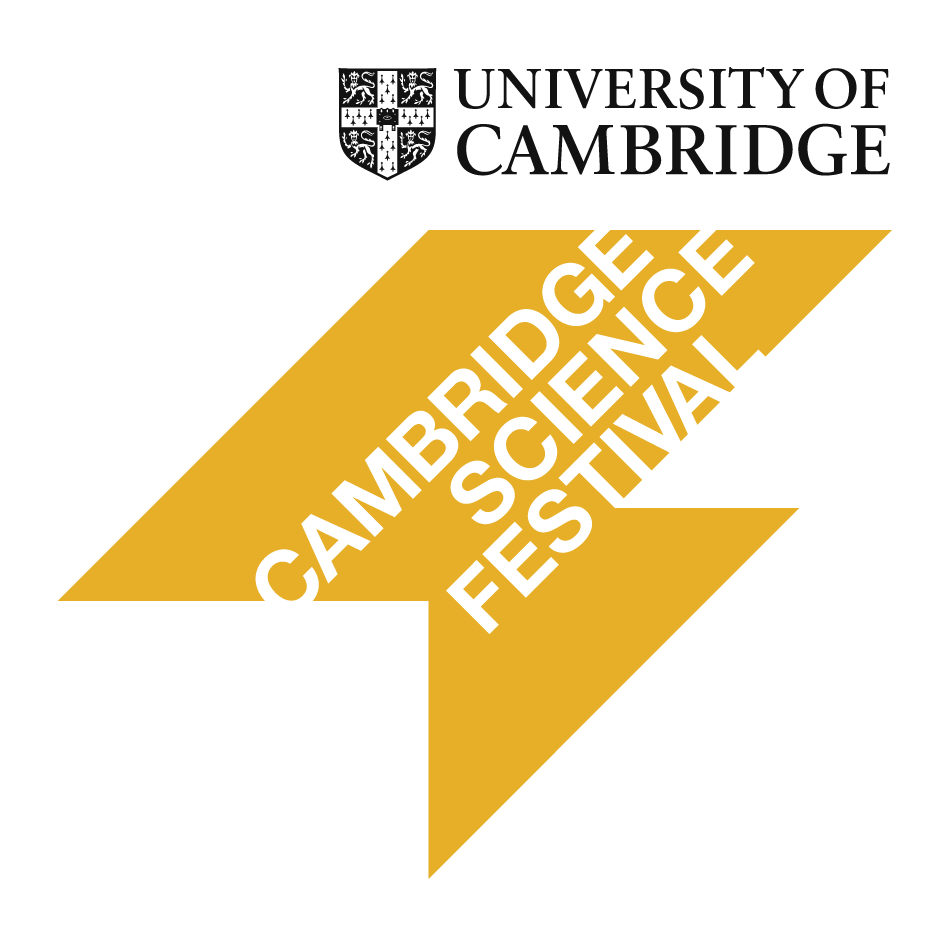

# It takes 3 to Tango: Key players for a successful pregnancy

Hello! 
We are postdocs from the [Department of Obs & Gynae](https://www.obgyn.cam.ac.uk/), [University of Cambridge](https://www.cam.ac.uk/) and we run a [Science Festival](https://www.sciencefestival.cam.ac.uk/) stall.

## Description

Learn about the key players in a healthy pregnancy: the mum, the baby and the placenta. Discuss the latest research at the [Department of Obstetrics & Gynaecology](https://www.obgyn.cam.ac.uk/) and understand the role of the placenta through interactive hands-on activities.

[Placenta](https://en.wikipedia.org/wiki/Placenta) is a very important organ, yet often overlooked. At our interactive display you can learn how the placenta looks like and what jobs it performs. Kids and parents can have a go at a placenta maze game or model the placenta out of play dough. You will also have an opportunity to learn interactively about healthy diet and lifestyle during pregnancy and about antenatal care and the baby’s development. We will demonstrate the assessment of fetal growth using various methods and you will have a chance to examine ultrasound images of babies.

At the [Department of Obstetrics and Gynaecology](https://www.obgyn.cam.ac.uk/), we do research on the biology and the function of the placenta. We also conduct large population studies which aim at identifying key features that could predict problems in pregnancy. Our ultimate goal is to find better ways of helping mums to give birth to healthy babies.

## Quiz for **it takes 3 to Tango** 
* [:woman:](https://sung.github.io/CamObsGynCSF2020/pregnancy_myth.html)
* [:baby:](https://sung.github.io/CamObsGynCSF2020/baby_scan.html)
* [Placenta](https://sung.github.io/CamObsGynCSF2020/placenta_quiz.html)

## Links 
* [Source code](https://github.com/sung/CamObsGynCSF2020)
* [Web site](https://sung.github.io/CamObsGynCSF2020)
* The quiz websites shown above were cloned and modified from [here](https://github.com/UrbanInstitute/barriers-homeownership-quiz)

## Contributors
* **Anita** - *placenta 3D printing model*
* **Dafina** - *quiz and badges*
* **Elin** - *the placenta poster*
* **Francesca** - *bringing inital idea of this event and the mum poster*
* **Fuyan** - *communication and organisation*
* **Giulia** - *communication and organisation*
* **Ionel** - *the mum and the baby posters*
* **Irving** - *logistics, communication and organisation*
* **Sung** - *quiz and most of geeky stuff including this site* 
* **Ulla** - *communication, organisation and assessment of this event*

## Acknowledgement
* This project is funded by Public Engagment Starter Fund, University of Cambridge

## Copyright
* &copy; 2020 SPROG

---

